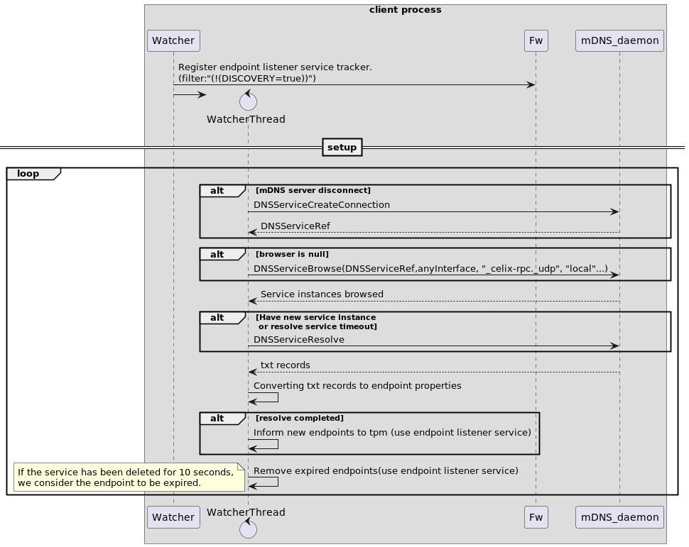

<!--
Licensed to the Apache Software Foundation (ASF) under one or more
contributor license agreements.  See the NOTICE file distributed with
this work for additional information regarding copyright ownership.
The ASF licenses this file to You under the Apache License, Version 2.0
(the "License"); you may not use this file except in compliance with
the License.  You may obtain a copy of the License at
   
    http://www.apache.org/licenses/LICENSE-2.0

Unless required by applicable law or agreed to in writing, software
distributed under the License is distributed on an "AS IS" BASIS,
WITHOUT WARRANTIES OR CONDITIONS OF ANY KIND, either express or implied.
See the License for the specific language governing permissions and
limitations under the License.
-->

## Discovery Zeroconf

The `Discovery_zeroconf` is implemented based on mDNS, and its operation depends on the mDNS daemon.

The mapping between celix and mdns services is as follows:

| **mDNS service** | **celix service**                         |
|------------------|-------------------------------------------|
| instance name    | service name+hash(endpoint uuid)          |
| service type     | "_celix-rpc._udp"+${custom subtype}       |
| domain name      | "local"                                   |
| txt record       | service properties                        |
| host             | "celix_rpc_dumb_host.local."(It is dummy) |
| port             | 50009(It is dummy)                        |

Because We will perform the mDNS query only using link-local multicast, so we set domain name default value "local".

To reduce the operation of conversion between host name and address info. we set the address info to txt record, and set a dummy value("celix_rpc_dumb_host.local." and "50009") to the host name and port.

We set the instance name of the mDNS service as `service_name + hash(endpoint uuid)`. If there is a conflict in the instance name, mDNS_daemon will resolve it. Since the maximum size of the mDNS service instance name is 64 bytes, we take the hash of the endpoint uuid here, which also reduces the probability of instance name conflicts.

According to [rfc6763](https://www.rfc-editor.org/rfc/rfc6763.txt) 6.1 and 6.2 section, DNS TXT record can be up to 65535 (0xFFFF) bytes long in mDNS message. and we should keep the size of the TXT record under 1300 bytes(allowing it to fit in a single 1500-byte Ethernet packet). Therefore, `Discovery_zeroconf` announce celix service endpoint using multiple txt records and each txt record max size is 1300 bytes.

### Supported Platform
- Linux

### Conan Option
    build_rsa_discovery_zeroconf=True   Default is False

### CMake Option
    RSA_DISCOVERY_ZEROCONF=ON           Default is OFF

### Software Design

#### The Remote Service Endpoint Announce Process

In the process of publishing remote service endpoints, `discovery_zeroconf` provides an `endpoint_listener_t` service, and sets the service property `DISCOVERY=true`. `topology_manager` updates service endpoint description to `discovery_zeroconf` by calling this service. At the same time, `discovery_zeroconf` establishes a domain socket connection with `mDNS_daemon`, and `discovery_zeroconf` publishes the service information to mDNS_daemon through this connection. Then, `mDNS_daemon` publishes the service information to other `mDNS_daemons`. The sequence diagram is as follows:

#### The Remote Service Endpoint Discovery Process

In the process of discovering remote service endpoints, discovery_zeroconf also establishes a domain socket connection with mDNS_daemon. discovery_zeroconf listens to remote endpoint information through this connection, and updates the listened remote endpoint information to topology_manager. The sequence diagram is as follows:

### Example

See the cmake target `remote-services-zeroconf-server` and `remote-services-zeroconf-client`.

**Notes:** Before running the example, you should start the [mDNS](https://github.com/apple-oss-distributions/mDNSResponder) daemon first.
