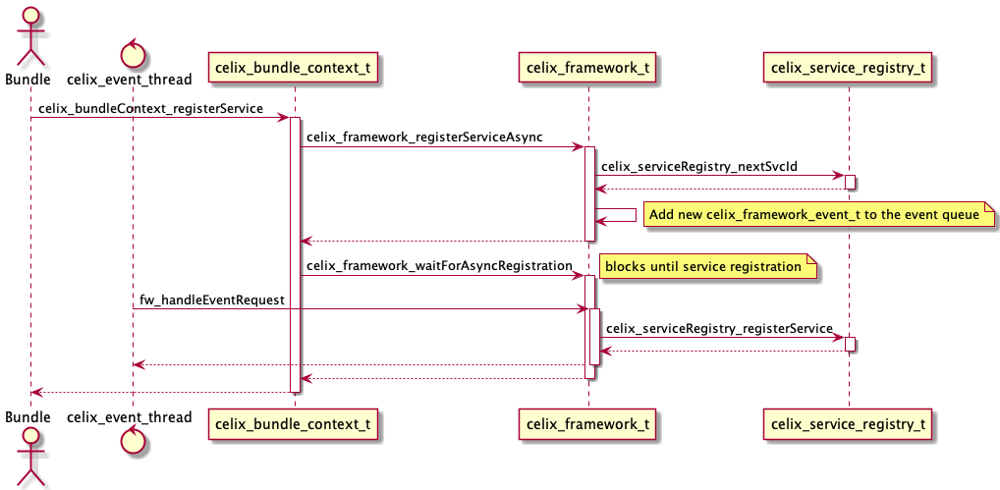
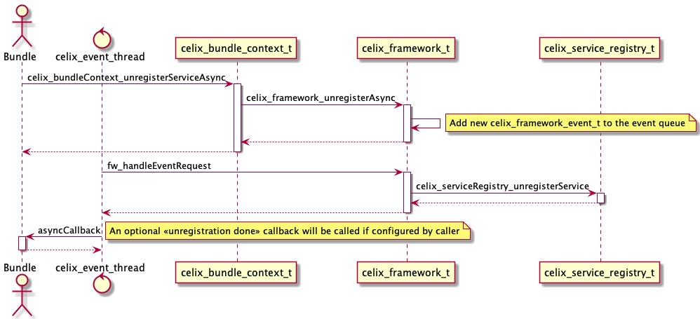
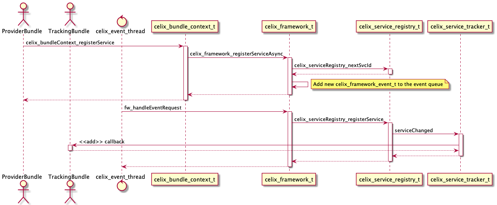
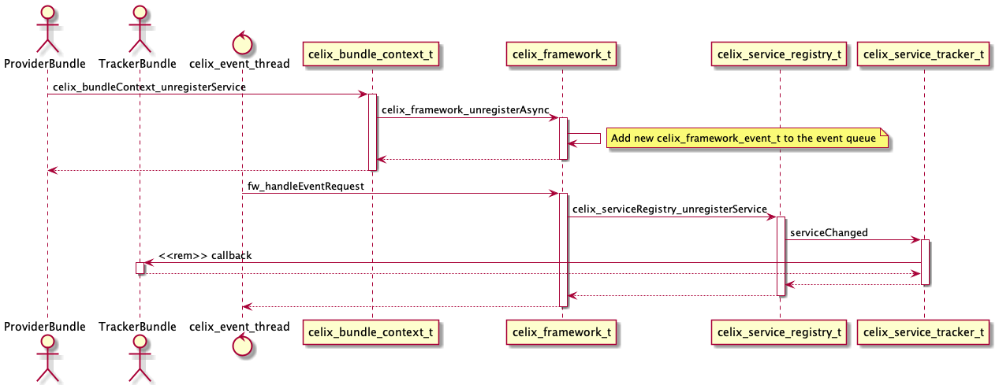
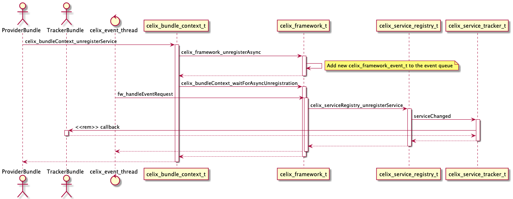

<!--
Licensed to the Apache Software Foundation (ASF) under one or more
contributor license agreements.  See the NOTICE file distributed with
this work for additional information regarding copyright ownership.
The ASF licenses this file to You under the Apache License, Version 2.0
(the "License"); you may not use this file except in compliance with
the License.  You may obtain a copy of the License at
   
    http://www.apache.org/licenses/LICENSE-2.0

Unless required by applicable law or agreed to in writing, software
distributed under the License is distributed on an "AS IS" BASIS,
WITHOUT WARRANTIES OR CONDITIONS OF ANY KIND, either express or implied.
See the License for the specific language governing permissions and
limitations under the License.
-->

# Services
An Apache Celix Service is a pointer registered to the Celix framework under a set of properties (metadata).
Services can be dynamically registered into and looked up from the Celix framework.

By convention a C service in Apache Celix is a pointer to struct of function pointers and a C++ service is a pointer
(which can be provided as a `std::shared_ptr`) to an object implementing a (pure) abstract class.

A service is always register under a service name and this service name is also used to lookup services. 
For C the service name must be provided by the user and for C++ the service name can be provided by the user. 
If for C++ no service name is provided the service name will be inferred based on the service template argument using
`celix::typeName<I>`. 

Note that the service name is represented in the service properties under the property name `objectClass`, 
this is inherited for the Java OSGi specification. 
Also note that for Celix - in contrast with Java OSGi - it is only possible to register a single interface 
per service registration in the Celix Framework. This restriction was added because C does not (natively) supports
multiple interfaces (struct with function pointers) on a single object/pointer.  

## A C service example
As mentioned an Apache Celix C service is a registered pointer to a struct with function pointers. 
This struct ideally contains a handle pointer, a set of function pointers and should be well documented to
form a well-defined service contract.

A simple example of an Apache Celix C service is a shell command service. 
For C, the shell command header looks like:
```C
//celix_shell_command.h
...
#define CELIX_SHELL_COMMAND_NAME                "command.name"
#define CELIX_SHELL_COMMAND_USAGE               "command.usage"
#define CELIX_SHELL_COMMAND_DESCRIPTION         "command.description"

#define  CELIX_SHELL_COMMAND_SERVICE_NAME       "celix_shell_command"
#define  CELIX_SHELL_COMMAND_SERVICE_VERSION    "1.0.0"

typedef struct celix_shell_command celix_shell_command_t;

/**
 * The shell command can be used to register additional shell commands.
 * This service should be registered with the following properties:
 *  - command.name: mandatory, name of the command e.g. 'lb'
 *  - command.usage: optional, string describing how tu use the command e.g. 'lb [-l | -s | -u]'
 *  - command.description: optional, string describing the command e.g. 'list bundles.'
 */
struct celix_shell_command {
    void *handle;

    /**
     * Calls the shell command.
     * @param handle        The shell command handle.
     * @param commandLine   The complete provided cmd line (e.g. for a 'stop' command -> 'stop 42')
     * @param outStream     The output stream, to use for printing normal flow info.
     * @param errorStream   The error stream, to use for printing error flow info.
     * @return              Whether a command is successfully executed.
     */
    bool (*executeCommand)(void *handle, const char *commandLine, FILE *outStream, FILE *errorStream);
};
```

The service struct is documented, explains which service properties needs to be provided, contains a handle pointer and
a `executeCommand` function pointer. 

The `handle` field and the `handle` function argument should function as an opaque instance (`this` / `self`) handle 
and generally is unique for every service instance. Users of the service should forward the handle field when calling
a service function, e.g.:
```C
celix_shell_command_t* command = ...;
command->executeCommand(command->handle, "test 123", stdout, stderr);
```

## A C++ service example
As mentioned an Apache Celix C++ service is a registered pointer to an object implementing an abstract class.
The service class ideally should be well documented to form a well-defined service contract.

A simple example of an Apache Celix C++ service is a C++ shell command. 
For C++, the shell command header looks like:
```C++
//celix/IShellCommand.h
...
namespace celix {

    /**
     * The shell command interface can be used to register additional Celix shell commands.
     * This service should be registered with the following properties:
     *  - name: mandatory, name of the command e.g. 'celix::lb'
     *  - usage: optional, string describing how tu use the command e.g. 'celix::lb [-l | -s | -u]'
     *  - description: optional, string describing the command e.g. 'list bundles.'
     */
    class IShellCommand {
    public:
        /**
         * The required name of the shell command service (service property)
         */
        static constexpr const char * const COMMAND_NAME = "name";

        /**
         * The optional usage text of the shell command service (service property)
         */
        static constexpr const char * const COMMAND_USAGE = "usage";

        /**
         * The optional description text of the shell command service (service property)
         */
        static constexpr const char * const COMMAND_DESCRIPTION = "description";

        virtual ~IShellCommand() = default;

        /**
         * Calls the shell command.
         * @param commandLine   The complete provided command line (e.g. for a 'stop' command -> 'stop 42'). Only valid during the call.
         * @param commandArgs   A list of the arguments for the command (e.g. for a "stop 42 43" commandLine -> {"42", "43"}). Only valid during the call.
         * @param outStream     The C output stream, to use for printing normal flow info.
         * @param errorStream   The C error stream, to use for printing error flow info.
         * @return              Whether the command has been executed correctly.
         */
        virtual void executeCommand(const std::string& commandLine, const std::vector<std::string>& commandArgs, FILE* outStream, FILE* errorStream) = 0;
    };
}
```

A with the C shell command struct, the C++ service class is documented and explains which service properties needs to 
be provided. The `handle` construct is not needed for C++ services and using a C++ service function is just the same 
as calling a function member of any C++ object.

## Registering and un-registering services

Service registration and un-registration in Celix can be done synchronized or asynchronized and although 
(un-)registering services synchronized is more inline with the OSGi spec, (un-)registering is preferred for Celix. 

When registering a service synchronized, the service registration event and all events resulting from the service
registration are handled; in practice this means that when a synchronized service registration returns all bundles
are aware of the new service and if needed have updated their administration accordingly.

Synchronized service (un-)registration can lead to problems if for example another service registration event is 
triggered on the handling of the current service registration events. 
In that case normal mutexes are not always enough and reference counting or recursive mutexes are needed. 
reference counting can be complex to handle (especially in C) and recursive mutexes are arguable a bad idea.

Interestingly for Java the use of `synchronized` is recursive and as result this seems te be smaller issue with Java.

When registering a service asynchronized, the service properties and specifically the `service.id` property will be 
finalized when the service registration call returns. The actual service registration event will be done asynchronized
by the Celix event thread and this can be done before or after the service registration call returns.

To register a service asynchronized the following C functions / C++ methods can be used:
 - `celix_bundleContext_registerServiceAsync`.
 - `celix_bundleContext_registerServiceWithOptionsAsync`.
 - `celix::BundleContext::registerService`.
 - `celix::BundleContext::registerUnmanagedService`.

To register a service synchronized the following C functions / C++ methods can be used:
 - `celix_bundleContext_registerService`.
 - `celix_bundleContext_registerServiceWithOptions`.
 - `celix::BundleContext::registerService`, use `celix::ServiceRegistrationBuilder::setRegisterAsync` to configure 
    registration synchronized because the default is asynchronized.
 - `celix::BundleContext::registerUnmanagedService`, use `celix::ServiceRegistrationBuilder::setRegisterAsync` 
   to configure registration synchronized because the default is asynchronized.
 

To unregister a service asynchronized the following C function can be used:
- `celix_bundleContext_unregisterServiceAsync`.

And to unregister a service synchronized the following C function can be used:
- `celix_bundleContext_unregisterService`.

For C++ a service un-registration happens when its corresponding `celix::ServiceRegistration` object goes out of 
scope. A C++ service can be configured for synchronized un-registration using ServiceRegistrationBuilder, 
specifically:
- `celix::ServiceRegistrationBuilder::setUnregisterAsync`. The default is asynchronized. 

### Example: Register a service in C

```C
//src/my_shell_command_provider_bundle_activator.c
typedef struct my_shell_command_provider_activator_data {
    celix_bundle_context_t* ctx;
    celix_shell_command_t shellCmdSvc;
    long shellCmdSvcId;
} my_shell_command_provider_activator_data_t;

static bool my_shell_command_executeCommand(void *handle, const char *commandLine, FILE *outStream, FILE *errorStream __attribute__((unused))) {
    my_shell_command_provider_activator_data_t* data = handle;
    celix_bundle_t* bnd = celix_bundleContext_getBundle(data->ctx);
    fprintf(outStream, "Hello from bundle %s with command line '%s'\n", celix_bundle_getName(bnd), commandLine);
    return true;
}

static celix_status_t my_shell_command_provider_bundle_start(my_shell_command_provider_activator_data_t *data, celix_bundle_context_t *ctx) {
    data->ctx = ctx;
    data->shellCmdSvc.handle = data;
    data->shellCmdSvc.executeCommand = my_shell_command_executeCommand;
    
    celix_properties_t* props = celix_properties_create();
    celix_properties_set(props, CELIX_SHELL_COMMAND_NAME, "my_command");
    
    data->shellCmdSvcId = celix_bundleContext_registerServiceAsync(ctx, &data->shellCmdSvc, CELIX_SHELL_COMMAND_SERVICE_NAME, props);
    return CELIX_SUCCESS;
}

static celix_status_t my_shell_command_provider_bundle_stop(my_shell_command_provider_activator_data_t *data, celix_bundle_context_t *ctx) {
    celix_bundleContext_unregisterServiceAsync(ctx, data->shellCmdSvcId, NULL, NULL);
    return CELIX_SUCCESS;
}

CELIX_GEN_BUNDLE_ACTIVATOR(my_shell_command_provider_activator_data_t, my_shell_command_provider_bundle_start, my_shell_command_provider_bundle_stop)
```

### Example: Register a C++ service in C++
```C++
//src/MyShellCommandBundleActivator.cc
...
class MyCommand : public celix::IShellCommand {
public:
    explicit MyCommand(std::string_view _name) : name{_name} {}

    ~MyCommand() noexcept override = default;

    void executeCommand(
            const std::string& commandLine,
            const std::vector<std::string>& /*commandArgs*/,
            FILE* outStream,
            FILE* /*errorStream*/) override {
        fprintf(outStream, "Hello from bundle %s with command line '%s'\n", name.c_str(), commandLine.c_str());
    }
private:
    const std::string name;
};

class MyShellCommandProvider {
public:
    explicit MyShellCommandProvider(const std::shared_ptr<celix::BundleContext>& ctx) {
        auto svcObject = std::make_shared<MyCommand>(ctx->getBundle().getName());
        cmdShellRegistration = ctx->registerService<celix::IShellCommand>(std::move(svcObject))
                .addProperty(celix::IShellCommand::COMMAND_NAME, "MyCommand")
                .build();
    }

    ~MyShellCommandProvider() noexcept = default;
private:
    //NOTE when celix::ServiceRegistration goes out of scope the underlining service will be un-registered
    std::shared_ptr<celix::ServiceRegistration> cmdShellRegistration{};
};

CELIX_GEN_CXX_BUNDLE_ACTIVATOR(MyShellCommandProvider)
```

### Example: Register a C service in C++

```C++
class MyShellCommandProvider {
public:
    explicit MyShellCommandProvider(std::shared_ptr<celix::BundleContext>  _ctx) : ctx{std::move(_ctx)} {
        shellCmd.handle = static_cast<void*>(this);
        shellCmd.executeCommand = [] (void *handle, const char* commandLine, FILE* outStream, FILE* /*errorStream*/) -> bool {
            auto* cmdProvider = static_cast<MyShellCommandProvider*>(handle);
            fprintf(outStream, "Hello from bundle %s with command line '%s'\n", cmdProvider->ctx->getBundle().getName().c_str(), commandLine);
            return true;
        };
        cmdShellRegistration = ctx->registerUnmanagedService<celix_shell_command>(&shellCmd)
                .addProperty(CELIX_SHELL_COMMAND_NAME, "MyCCommand")
                .build();
    }

    ~MyShellCommandProvider() noexcept = default;
private:
    const std::shared_ptr<celix::BundleContext> ctx;
    celix_shell_command shellCmd{};
    
    //NOTE when celix::ServiceRegistration goes out of scope the underlining service will be un-registered
    std::shared_ptr<celix::ServiceRegistration> cmdShellRegistration{};
};

CELIX_GEN_CXX_BUNDLE_ACTIVATOR(MyShellCommandProvider)
```

### Sequence diagrams for service registration


A asynchronized service registration
---


A synchronized service registration
---


A asynchronized service un-registration
---


A synchronized service un-registration
---

## Using services
TODO

## Tracking services
TODO

### Sequence diagrams for service tracker and service registration


Service tracker callback with an asynchronized service registration
---


Service tracker callback with an asynchronized service un-registration
---


Service tracker callback with a synchronized service registration
---


Service tracker callback with a synchronized service un-registration
---

## Impact of dynamic services
Services in Apache Celix are dynamic, meaning that they can come and go at any moment.
This makes it possible to create emerging functionality based on the coming and going of Celix services.
How to cope with this dynamic behaviour is critical for creating a stable solution.

For Java OSGi this is already a challenge to program correctly, but less critical because generally speaking the
garbage collector will arrange that objects still exists even if the providing bundle is un-installed.
Taking into account that C and C++ has no garbage collection, handling the dynamic behaviour correctly is
more critical; If a bundle providing a certain service is removed, the code segment / memory allocated for
the service will also be removed / deallocated.

Apache Celix has several mechanisms for dealing with this dynamic behaviour:

* A built-in abstraction to use services with callbacks function where the Celix framework ensures the services
  are not removed during callback execution.
  See `celix_bundleContext_useService(s)` and `celix::BundleContext::useService(s)` for more info.
* Service trackers which ensure that service can only complete their un-registration when all service
  remove callbacks have been processed.
  See `celix_bundleContext_trackServices` and `celix::BundleContext::trackServices` for more info.
* Components with declarative service dependency so that a component life cycle is coupled with the availability of
  service dependencies. See the components' documentation section for more information about components.
* The Celix framework will handle all service registration/un-registration events and the starting/stopping of trackers
  on the Celix event thread to ensure that only 1 event can be processed per time.
* For service registration, service un-registration, starting trackers and closing trackers there are async variants
  which can be used in the Celix event thread. For C most of the async function variants end with a `Async` postfix
  and for C++ this is handled as an option in the Builder objects. Also, for C++ the default enabled options are async.